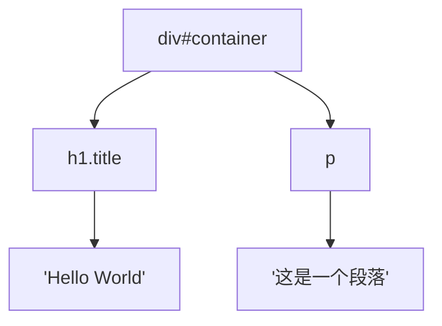
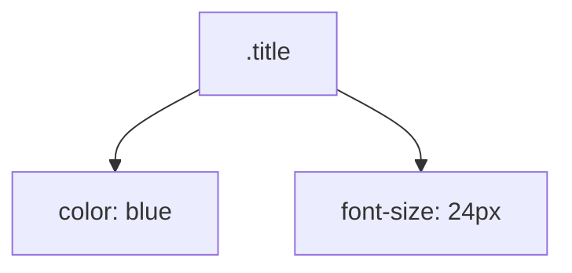

# Welcome to Front-end

Herald Studio 2025

<div @click="$slidev.nav.next" class="mt-12 py-1" hover:bg="white op-10">
  Press Space for next page <carbon:arrow-right />
</div>

<div class="abs-br m-6 text-xl">
  <button @click="$slidev.nav.openInEditor()" title="Open in Editor" class="slidev-icon-btn">
    <carbon:edit />
  </button>
  <a href="https://github.com/slidevjs/slidev" target="_blank" class="slidev-icon-btn">
    <carbon:logo-github />
  </a>
</div>

---
transition: slide-up
---

# (1) JavaScript 语言核心特性

## 解释执行

<div class="py-1"></div>

- **编译型语言**：C/C++、Go → 编译成机器码 → 执行
- **解释型语言**：JavaScript → 逐行解释执行
- 开发快速、跨平台、动态性强 / 执行速度相对较慢

JavaScript 代码直接在浏览器中执行

```javascript {monaco-run} {autorun:false}
console.log('Hello World');
```

<div class="py-1"></div>

```javascript {monaco-run} {autorun:false}
console.log(0.2 + 0.1);
```

<style>
h1 {
  background-color: #2B90B6;
  background-image: linear-gradient(45deg, #4EC5D4 10%, #146b8c 20%);
  background-size: 100%;
  -webkit-background-clip: text;
  -moz-background-clip: text;
  -webkit-text-fill-color: transparent;
  -moz-text-fill-color: transparent;
}
</style>

<!--
Here is another comment.
-->

---
transition: slide-up
level: 2
---

# (1) JavaScript 语言核心特性

## 单线程与事件循环

<div class="py-1"></div>

- **单线程**：JavaScript 主线程只有一个，同一时间**我们写的程序**只能执行一个任务
- **事件循环**：处理异步操作的机制

- 宿主环境（浏览器、Node.js）提供异步功能（setTimeout、DOM事件等）

```javascript {monaco-run} {autorun:false}
console.log('1');
setTimeout(() => console.log('2'), 0);
console.log('3');
```

<style>
h1 {
  background-color: #2B90B6;
  background-image: linear-gradient(45deg, #4EC5D4 10%, #146b8c 20%);
  background-size: 100%;
  -webkit-background-clip: text;
  -moz-background-clip: text;
  -webkit-text-fill-color: transparent;
  -moz-text-fill-color: transparent;
}
</style>

---
transition: slide-up
level: 2
---

# (1) JavaScript 语言核心特性

## 任务队列

<div class="py-1"></div>

- **宏任务队列**：setTimeout、setInterval、I/O操作
- **微任务队列**：Promise.then、queueMicrotask
- **执行顺序**：同步代码 → 微任务 → 宏任务

<div class="py-1"></div>

```javascript {monaco-run} {autorun:false}
console.log('start');

setTimeout(() => console.log('timeout'), 0);

Promise.resolve().then(() => console.log('promise'));

console.log('end');
```

<style>
h1 {
  background-color: #2B90B6;
  background-image: linear-gradient(45deg, #4EC5D4 10%, #146b8c 20%);
  background-size: 100%;
  -webkit-background-clip: text;
  -moz-background-clip: text;
  -webkit-text-fill-color: transparent;
  -moz-text-fill-color: transparent;
}
</style>

---
transition: slide-up
level: 2
---

# (1) JavaScript 语言核心特性

## 异步与Promise

**异步编程演进**：回调函数 → Promise → async/await

```javascript {monaco-run} {autorun:false}
// Promise 基本用法
const fetchData = () => {
  return new Promise((resolve, reject) => {
    setTimeout(() => { resolve('数据获取成功'); }, 1000);
  });
};

// async/await 语法
async function getData() {
  try {
    const result = await fetchData();
    console.log(result);
  } catch (error) { console.error(error); }
}

getData();
```

<style>
h1 {
  background-color: #2B90B6;
  background-image: linear-gradient(45deg, #4EC5D4 10%, #146b8c 20%);
  background-size: 100%;
  -webkit-background-clip: text;
  -moz-background-clip: text;
  -webkit-text-fill-color: transparent;
  -moz-text-fill-color: transparent;
}
</style>

---
transition: slide-up
level: 2
---

# (1) JavaScript 语言核心特性

## 弱类型语言

<div class="py-1"></div>

- **动态类型**：变量类型在运行时确定
- **类型转换**：自动进行隐式类型转换

```javascript {monaco-run} {autorun:false}
let value = 42;        // number
value = 'hello';       // string
value = true;          // boolean
value = [1, 2, 3];     // array
console.log(value);

// 隐式类型转换
console.log('5' + 3);  // '53' (字符串拼接)
console.log('5' - 3);  // 2 (数值运算)
console.log(true + 1); // 2
```

<style>
h1 {
  background-color: #2B90B6;
  background-image: linear-gradient(45deg, #4EC5D4 10%, #146b8c 20%);
  background-size: 100%;
  -webkit-background-clip: text;
  -moz-background-clip: text;
  -webkit-text-fill-color: transparent;
  -moz-text-fill-color: transparent;
}
</style>

---
transition: slide-up
level: 2
---

# (2) TypeScript 类型系统

## “运行时”与“编译时”

<div class="py-1"></div>

- **编译时**：TypeScript 编译器检查类型错误
- **运行时**：编译后的 JavaScript 代码执行
- **类型擦除**：编译后类型信息被移除
- **开发体验**：IDE 智能提示、错误检测

<div class="py-1"></div>

```typescript {monaco-run} {autorun:false}
// 编译时类型检查
function add(a: number, b: number): number { // 如果删掉 number？
  return a + b;
}

// add(1, '2'); // ❌ 编译时错误
const result = add(1, 2);   // ✅ 正确

console.log(result);
```

<style>
h1 {
  background-color: #2B90B6;
  background-image: linear-gradient(45deg, #4EC5D4 10%, #146b8c 20%);
  background-size: 100%;
  -webkit-background-clip: text;
  -moz-background-clip: text;
  -webkit-text-fill-color: transparent;
  -moz-text-fill-color: transparent;
}
</style>

---
transition: slide-up
level: 2
---

# (2) TypeScript 类型系统

## 基本类型

<div class="py-1"></div>

```typescript
// 基础类型
let name: string = 'Alice';
let age: number = 25;
let isStudent: boolean = true;
let hobbies: string[] = ['reading', 'coding'];
let nothing: null = null;
let notDefined: undefined = undefined;

// 联合类型
let id: string | number = 123;

// 字面量类型
let status: 'pending' | 'success' | 'error' = 'pending';

// any 类型（尽量避免使用）
let anything: any = 'hello';

// unknown 类型
let unknownValue: unknown = 'hello';
```

<style>
h1 {
  background-color: #2B90B6;
  background-image: linear-gradient(45deg, #4EC5D4 10%, #146b8c 20%);
  background-size: 100%;
  -webkit-background-clip: text;
  -moz-background-clip: text;
  -webkit-text-fill-color: transparent;
  -moz-text-fill-color: transparent;
}
</style>

---
transition: slide-up
level: 2
---

# (2) TypeScript 类型系统

## 函数类型

<div class="h-[100%]">

<v-switch>
  <template #1>

<div class="h-[100%]">
```typescript {monaco}
// 函数声明
function greet(name: string): string {
  return `Hello, ${name}!`;
}
```
</div>

  </template>
  <template #2>

<div class="h-[100%]">

```typescript {monaco}
// 函数声明
function greet(name: string): string {
  return `Hello, ${name}!`;
}

// 箭头函数
const multiply = (a: number, b: number): number => a * b;
```
</div>

  </template>
  <template #3>

<div class="h-[100%]">

```typescript {monaco}
// 函数声明
function greet(name: string): string {
  return `Hello, ${name}!`;
}

// 箭头函数
const multiply = (a: number, b: number): number => a * b;

// 可选参数
function createUser(name: string, age?: number) {
  return { name, age: age || 0 };
}
```

</div>

  </template>
  <template #4>

<div class="h-[100%]">

```typescript {monaco}
// 函数声明
function greet(name: string): string {
  return `Hello, ${name}!`;
}

// 箭头函数
const multiply = (a: number, b: number): number => a * b;

// 可选参数
function createUser(name: string, age?: number) {
  return { name, age: age || 0 };
}

// 函数类型
type Calculator = (x: number, y: number) => number;
const add: Calculator = (x, y) => x + y;
```
</div>

  </template>
  <template #5>

<div class="h-[100%]">

```typescript {monaco}
// 函数声明
function greet(name: string): string {
  return `Hello, ${name}!`;
}

// 箭头函数
const multiply = (a: number, b: number): number => a * b;

// 可选参数
function createUser(name: string, age?: number) {
  return { name, age };
}

// 函数类型
type Calculator = (x: number, y: number) => number;
const add: Calculator = (x, y) => x + y;
```
</div>

  </template>
  <template #6>

<div class="h-[100%]">

```typescript {monaco}
// 函数声明
function greet(name: string): string {
  return `Hello, ${name}!`;
}

// 箭头函数
const multiply = (a: number, b: number): number => a * b;

// 可选参数
function createUser(name: string, age?: number) : {
  name: string;
  age: number;
} {
  return { name, age };
}

// 函数类型
type Calculator = (x: number, y: number) => number;
const add: Calculator = (x, y) => x + y;
```
</div>

  </template>
</v-switch>

</div>

<style>
h1 {
  background-color: #2B90B6;
  background-image: linear-gradient(45deg, #4EC5D4 10%, #146b8c 20%);
  background-size: 100%;
  -webkit-background-clip: text;
  -moz-background-clip: text;
  -webkit-text-fill-color: transparent;
  -moz-text-fill-color: transparent;
}
</style>

---
transition: slide-up
level: 2
---

# (2) TypeScript 类型系统

## 接口、泛型与高级抽象

```typescript
// 接口定义
interface User {
  id: number;
  name: string;
  email?: string; // 可选属性
  readonly createdAt: Date; // 只读属性
}

// 泛型函数
function identity<T>(arg: T): T {
  return arg;
}

// 泛型接口
interface ApiResponse<T> {
  data: T;
  status: number;
  message: string;
}
```

<style>
h1 {
  background-color: #2B90B6;
  background-image: linear-gradient(45deg, #4EC5D4 10%, #146b8c 20%);
  background-size: 100%;
  -webkit-background-clip: text;
  -moz-background-clip: text;
  -webkit-text-fill-color: transparent;
  -moz-text-fill-color: transparent;
}
</style>

---
layout: two-cols
layoutClass: gap-8
transition: slide-up
---

# (3) 从文档到应用

## HTML & DOM CSS & CSSOM

- **HTML**：超文本标记语言，定义网页结构
- **DOM**：文档对象模型，HTML在内存中的树形表示
- **CSS**：层叠样式表，定义网页样式
- **CSSOM**：CSS对象模型，CSS在内存中的表示

```html
<!-- HTML 结构 -->
<div id="container">
  <h1 class="title">Hello World</h1>
  <p>这是一个段落</p>
</div>
```

```css
/* CSS 样式 */
.title {
  color: blue;
  font-size: 24px;
}
```

::right::





<style>
h1 {
  background-color: #2B90B6;
  background-image: linear-gradient(45deg, #4EC5D4 10%, #146b8c 20%);
  background-size: 100%;
  -webkit-background-clip: text;
  -moz-background-clip: text;
  -webkit-text-fill-color: transparent;
  -moz-text-fill-color: transparent;
}
</style>

---
transition: slide-up
level: 2
---

# (3) 从文档到应用

## JavaScript 操作 DOM

<div>

```typescript {monaco}
// 获取元素
const title = document.getElementById('title');
const button = document.querySelector('.btn');

// 修改内容
title.textContent = '新标题';
title.innerHTML = '<span>HTML内容</span>';

// 修改样式
title.style.color = 'red';
title.classList.add('active');

// 创建和添加元素
const newDiv = document.createElement('div');
newDiv.textContent = '新元素';
document.body.appendChild(newDiv);

// 事件监听
button.addEventListener('click', function() {
  alert('按钮被点击了！');
});
```
</div>

<style>
h1 {
  background-color: #2B90B6;
  background-image: linear-gradient(45deg, #4EC5D4 10%, #146b8c 20%);
  background-size: 100%;
  -webkit-background-clip: text;
  -moz-background-clip: text;
  -webkit-text-fill-color: transparent;
  -moz-text-fill-color: transparent;
}
</style>

---
transition: slide-up
level: 2
---

# (3) 从文档到应用

## Ajax

```javascript
// 原生Ajax
const xhr = new XMLHttpRequest();
xhr.open('GET', '/api/data');
xhr.onreadystatechange = function() {
  if (xhr.readyState === 4 && xhr.status === 200) {
    const data = JSON.parse(xhr.responseText);
    updateUI(data);
  }
};
xhr.send();
```
<v-click>

Ajax —— Asynchronous JavaScript And XML，现在泛指 JavaScript 发起网络请求的行为。

</v-click>

<v-click>

Ajax 技术的诞生催生了全新的前端应用范式 —— HTML 只负责静态“骨架”，内容由 JavaScript 远程获取后再进行渲染。

</v-click>

<!-- <v-click>

Ajax 技术的诞生催生了全新的前端应用范式 —— HTML 只负责静态“骨架”，内容由 JavaScript 远程获取后再进行渲染。

</v-click> -->

---
transition: slide-up
level: 2
---

# (3) 从文档到应用

## JavaScript 接管 DOM ？

```javascript
async function fetchDataAndDisplay() {
  const targetElement = document.getElementById('content');
  try {
    targetElement.innerHTML = '<p>加载中...</p>';
    const response = await fetch('https://jsonplaceholder.typicode.com/posts/1');
    if (!response.ok) throw new Error(`请求失败，状态码: ${response.status}`);

    const data = await response.json();

    targetElement.innerHTML = `<h2>${escapeHtml(data.title)}</h2>
      <p>${escapeHtml(data.body)}</p>
      <small>ID: ${data.id}</small>
    `;

  } catch (error) {
    console.error('获取数据失败:', error);
    targetElement.innerHTML = `<p class="error">加载失败: ${escapeHtml(error.message)}</p>`;
  }
}

fetchDataAndDisplay();
```

<style>
h1 {
  background-color: #2B90B6;
  background-image: linear-gradient(45deg, #4EC5D4 10%, #146b8c 20%);
  background-size: 100%;
  -webkit-background-clip: text;
  -moz-background-clip: text;
  -webkit-text-fill-color: transparent;
  -moz-text-fill-color: transparent;
}
</style>

<style>
h1 {
  background-color: #2B90B6;
  background-image: linear-gradient(45deg, #4EC5D4 10%, #146b8c 20%);
  background-size: 100%;
  -webkit-background-clip: text;
  -moz-background-clip: text;
  -webkit-text-fill-color: transparent;
  -moz-text-fill-color: transparent;
}
</style>

---
transition: slide-up
level: 2
---

# (3) 从文档到应用

所有DOM中的数据都需要JS管理，我们为什么干脆不让JS去创建DOM？

```js
const parent = document.body;
const child = document.createElement('p');
parent.appendChild(child); // <body><p></p></body>
```

**虚拟DOM**：JavaScript对象表示的DOM结构

```typescript
const virtualDOM = {
  type: 'div',
  props: {
    className: 'container',
    children: [
      {
        type: 'h1',
        props: { children: 'Hello React' }
      }
    ]
  }
};
```

<style>
h1 {
  background-color: #2B90B6;
  background-image: linear-gradient(45deg, #4EC5D4 10%, #146b8c 20%);
  background-size: 100%;
  -webkit-background-clip: text;
  -moz-background-clip: text;
  -webkit-text-fill-color: transparent;
  -moz-text-fill-color: transparent;
}
</style>

---
src: ./pages/imported-slides.md
hide: false
---

---
transition: slide-up
level: 2
---

# (4) React 框架

## JSX

<div class="py-1"></div>

### JavaScript XML - 在JS中写HTML

<div class="py-1"></div>

```typescript
const element = <h1>Hello, World!</h1>;

// JSX 表达式
const name = 'React';
const greeting = <h1>Hello, {name}!</h1>;

// JSX 属性
const image = ;
```

<v-click>

### JSX 编译后的结果

<div class="py-1"></div>

```typescript
// JSX: <h1>Hello, World!</h1>
// 编译后:
React.createElement('h1', null, 'Hello, World!');
```

React.createElement 被称为工厂函数，它可以创建**虚拟 DOM 对象**。

</v-click>

<style>
h1 {
  background-color: #2B90B6;
  background-image: linear-gradient(45deg, #4EC5D4 10%, #146b8c 20%);
  background-size: 100%;
  -webkit-background-clip: text;
  -moz-background-clip: text;
  -webkit-text-fill-color: transparent;
  -moz-text-fill-color: transparent;
}
</style>

---
layout: two-cols
layoutClass: gap-10
transition: slide-up
---

# (4) React 框架

<div class="py-1"></div>

## 函数组件 - 现代 React 的主流

<div class="py-1"></div>

```typescript
// 简单组件
function Welcome() {
  return <h1>欢迎使用React!</h1>;
}

// 带参数的组件
function UserCard({ name, age }) {
  return (
    <div className="user-card">
      <h2>{name}</h2>
      <p>年龄: {age}</p>
    </div>
  );
}
```

React JSX 提供完善的类型推导 —— 其实这要得益于微软把 JSX 相关处理内置进了 TypeScript。

::right::

<div class="py-12"></div>


<style>
h1 {
  background-color: #2B90B6;
  background-image: linear-gradient(45deg, #4EC5D4 10%, #146b8c 20%);
  background-size: 100%;
  -webkit-background-clip: text;
  -moz-background-clip: text;
  -webkit-text-fill-color: transparent;
  -moz-text-fill-color: transparent;
}
</style>

---
transition: slide-up
layout: two-cols
layoutClass: gap-10
---

# (4) React 框架

<div class="py-1"></div>

## 组件复用

<div class="py-1"></div>

```typescript
import UserCard from './UserCard';

function App() {
  return (
    <div>
      <UserCard name="张三" age={25} />
      <UserCard name="李四" age={30} />
    </div>
  );
}
```

调用上一页的组件 —— 像使用 HTML 标签一样使用函数组件。

原理：JSX 被编译为工厂函数的调用，工厂函数会按字符串寻找 —— 小写开头视为普通 HTML 标签，大写字母开头视为函数组件。

::right::

<div class="py-14"></div>

```typescript
function App() {
  return React.createElement(
    "div",
    null,
    React.createElement(UserCard, {
      name: "张三",
      age: 25,
    }),
    React.createElement(UserCard, {
      name: "李四",
      age: 30,
    })
  );
}
```

左侧代码的编译结果（等效写法），返回虚拟 DOM。

<style>
h1 {
  background-color: #2B90B6;
  background-image: linear-gradient(45deg, #4EC5D4 10%, #146b8c 20%);
  background-size: 100%;
  -webkit-background-clip: text;
  -moz-background-clip: text;
  -webkit-text-fill-color: transparent;
  -moz-text-fill-color: transparent;
}
</style>

---
transition: slide-up
level: 2
---

# (4) React 框架

<div class="py-1"></div>

## Props - 父组件向子组件传递数据

<div class="py-1"></div>

```typescript
// 子组件接收props
function Button({ text, onClick }) {
  return (
    <button onClick={onClick}> { text } </button>
  );
}

// 父组件传递props
function App() {
  const handleClick = () => alert('按钮被点击!');
  
  return (
    <Button 
      text="点击我" 
      onClick={handleClick} 
    />
  );
}
```


<style>
h1 {
  background-color: #2B90B6;
  background-image: linear-gradient(45deg, #4EC5D4 10%, #146b8c 20%);
  background-size: 100%;
  -webkit-background-clip: text;
  -moz-background-clip: text;
  -webkit-text-fill-color: transparent;
  -moz-text-fill-color: transparent;
}
</style>

---
transition: slide-up
level: 2
---

# (4) React 框架

<div class="py-1"></div>

## 事件

<div class="py-1"></div>

### React事件处理

```typescript
function LoginForm() {
  const handleSubmit = (e) => {
    e.preventDefault(); // 阻止默认行为
    console.log('表单提交');
  };
  
  return (
    <form onSubmit={handleSubmit}>
      <input type="text" placeholder="用户名" />
      <button type="submit">登录</button>
    </form>
  );
}
```

<style>
h1 {
  background-color: #2B90B6;
  background-image: linear-gradient(45deg, #4EC5D4 10%, #146b8c 20%);
  background-size: 100%;
  -webkit-background-clip: text;
  -moz-background-clip: text;
  -webkit-text-fill-color: transparent;
  -moz-text-fill-color: transparent;
}
</style>

---
transition: slide-up
layout: two-cols
layoutClass: gap-10
---

# (4) React 框架

## 状态驱动：useState

<div class="py-1"></div>

### 组件内部状态管理

<div class="py-1"></div>

```typescript
import { useState } from 'react';

function Counter() {
  const [count, setCount] = useState(0);
  
  return (
    <div>
      <p>当前计数: {count}</p>
      <button onClick={() => setCount(count + 1)}>
        增加
      </button>
      <button onClick={() => setCount(count - 1)}>
        减少
      </button>
    </div>
  );
}
```

::right::

<div class="py-17"></div>

### 状态更新触发重新渲染

- 状态改变 → 组件重新渲染 → UI更新
- React自动优化渲染性能
- 状态是组件的"记忆"

<div class="py-2"></div>

### “组件重新渲染”

指的是把这个函数完整的再运行一遍，得到新的虚拟 DOM ！

<style>
h1 {
  background-color: #2B90B6;
  background-image: linear-gradient(45deg, #4EC5D4 10%, #146b8c 20%);
  background-size: 100%;
  -webkit-background-clip: text;
  -moz-background-clip: text;
  -webkit-text-fill-color: transparent;
  -moz-text-fill-color: transparent;
}
</style>

---
transition: slide-up
layout: two-cols
layoutClass: gap-10
---

# (4) React 框架

<div class="py-1"></div>

## 副作用管理：useEffect

<div class="py-1"></div>

### 处理组件的副作用操作

<div class="py-1"></div>

```typescript
import { useState, useEffect } from 'react';

function UserProfile({ userId }) {
  const [user, setUser] = useState(null);
  
  // 组件挂载时获取用户数据
  useEffect(() => {
    fetch(`/api/users/${userId}`)
      .then(res => res.json())
      .then(setUser);
  }, [userId]); // 依赖数组
  
  if (!user) return <div>加载中...</div>;
  
  return <div>用户: {user.name}</div>;
}
```

::right::

<div class="py-17"></div>

依赖项目**修改后**重新执行。

空数组：只在组件挂载时执行一次。

返回值：可以返回一个函数，在组件卸载时执行。

### 常见用途

- 数据获取 (API调用)
- 订阅事件监听
- 定时器设置
- DOM操作

<style>
h1 {
  background-color: #2B90B6;
  background-image: linear-gradient(45deg, #4EC5D4 10%, #146b8c 20%);
  background-size: 100%;
  -webkit-background-clip: text;
  -moz-background-clip: text;
  -webkit-text-fill-color: transparent;
  -moz-text-fill-color: transparent;
}
</style>

---
transition: slide-up
layout: two-cols
layoutClass: gap-10
---

# (4) 开发工具

<div class="py-1"></div>

## Git

<div class="py-1"></div>

### 版本控制系统 - 代码管理的基石

<div class="py-1"></div>

```bash
# 初始化仓库
git init

# 添加文件到暂存区
git add .
git add filename.js

# 提交更改
git commit -m "添加新功能"

# 查看状态
git status

# 查看提交历史
git log --oneline
```

::right::

<div class="py-7"></div>

### 分支管理

```bash
# 创建并切换分支
git checkout -b feature/new-component

# 合并分支
git checkout main
git merge feature/new-component

# 推送到远程
git push origin main
```

<div class="py-2"></div>

### 为什么需要Git？

- **版本追踪**: 记录每次代码变更
- **协作开发**: 多人同时开发不冲突
- **回滚能力**: 出问题时快速恢复
- **分支管理**: 并行开发不同功能

<style>
h1 {
  background-color: #2B90B6;
  background-image: linear-gradient(45deg, #4EC5D4 10%, #146b8c 20%);
  background-size: 100%;
  -webkit-background-clip: text;
  -moz-background-clip: text;
  -webkit-text-fill-color: transparent;
  -moz-text-fill-color: transparent;
}
</style>

---
transition: slide-up
layout: image-right
---

# (4) 开发工具

## Chrome Devtools

<div class="py-3"></div>

### Elements：结构、样式调试

<div class="py-1"></div>

### Network：网络请求查看

<div class="py-1"></div>

### Console：日志、错误信息查看

<style>
h1 {
  background-color: #2B90B6;
  background-image: linear-gradient(45deg, #4EC5D4 10%, #146b8c 20%);
  background-size: 100%;
  -webkit-background-clip: text;
  -moz-background-clip: text;
  -webkit-text-fill-color: transparent;
  -moz-text-fill-color: transparent;
}
</style>

---
transition: slide-up
layout: two-cols
layoutClass: gap-10
---

# (5) 前端工程化

## 为什么要有构建工具

<div class="py-1"></div>

- **模块化**: 社区模块化规范需要打包
  - ESM 被浏览器原生支持，理论上可以`bundleless`。 Vite 的开发模式基于 ESM 的这一特性开发。
  - 在实践中，我们通常认为 ESM 模块化的项目打包也会带来好处。
- **新语法**: TypeScript、JSX需要编译
- **性能优化**: 代码压缩、Tree Shaking
  - All to ESM！
- **开发体验**: 热更新、错误提示

::right::

以下代码我们经常写，可是它们真的能被浏览器直接运行吗？

```typescript
import 'index.css';
```

 - 浏览器不支持将 CSS 文件识别为 JS 模块。

```typescript
import React from 'react';
```

 - 浏览器需要模块绝对路径，不能只有`react`。

```typescript
let num: number = 10;
```

 - 浏览器不支持将 TypeScript。

<style>
h1 {
  background-color: #2B90B6;
  background-image: linear-gradient(45deg, #4EC5D4 10%, #146b8c 20%);
  background-size: 100%;
  -webkit-background-clip: text;
  -moz-background-clip: text;
  -webkit-text-fill-color: transparent;
  -moz-text-fill-color: transparent;
}
</style>

---
transition: slide-up
layout: two-cols
layoutClass: gap-10
---

`index.tsx`

```typescript
import { greet } from './utils';
import { Hello } from './Hello';

const root = document.getElementById('root')!;
root.innerHTML = Hello('World');
```

`utils.ts`

```typescript
export function greet(name: string): string {
  return `Hello, ${name}!`;
}
```

`Hello.tsx`

```typescript
export function Hello(name: string): string {
  return `<h1>Hello ${name}</h1>`;
}
```

::right::

```
src/
├── index.tsx      // 入口文件
├── utils.ts      // 被 index.tsx 导入
└── Hello.tsx      // 一个组件，被 index.tsx 导入
```

打包后：

```javascript
(() => {
  // utils.ts
  function greet(name) {
    return `Hello, ${name}!`;
  }

  // Hello.tsx
  function Hello(name) {
    return `<h1>Hello ${name}</h1>`;
  }

  // index.tsx
  const root = document.getElementById('root');
  root.innerHTML = Hello('World');
})();
```

<style>
h1 {
  background-color: #2B90B6;
  background-image: linear-gradient(45deg, #4EC5D4 10%, #146b8c 20%);
  background-size: 100%;
  -webkit-background-clip: text;
  -moz-background-clip: text;
  -webkit-text-fill-color: transparent;
  -moz-text-fill-color: transparent;
}
</style>

---
transition: slide-up
layout: two-cols
layoutClass: gap-10
---

# (5) 前端工程化

<div class="py-1"></div>

## Vite

<div class="py-1"></div>

### Dev Server - 极速开发服务器

<div class="py-1"></div>

```bash
# 启动开发服务器
npm run dev
# 本质上在运行 package.json 中的 scripts
npx vite
```

**特点**:
- **原生ES模块**: 利用浏览器原生支持，无需打包
- **按需编译**: 只编译当前访问的文件

::right::

<div class="py-13"></div>

### HMR - 热模块替换

```javascript
// 修改组件代码时，页面自动更新，状态保持
function Counter() {
  const [count, setCount] = useState(0);
  
  return (
    <div>
      <p>计数: {count}</p> {/* 修改这里，页面立即更新 */}
      <button onClick={() => setCount(count + 1)}>+1</button>
    </div>
  );
}
```

**优势**: 修改代码 → 立即看到效果，无需刷新页面

**可能造成的问题**：代码运行时机？

<style>
h1 {
  background-color: #2B90B6;
  background-image: linear-gradient(45deg, #4EC5D4 10%, #146b8c 20%);
  background-size: 100%;
  -webkit-background-clip: text;
  -moz-background-clip: text;
  -webkit-text-fill-color: transparent;
  -moz-text-fill-color: transparent;
}
</style>

---
transition: slide-up
layout: two-cols
layoutClass: gap-10
---

# (5) 前端工程化

<div class="py-1"></div>

## Vite

<div class="py-1"></div>

### build - 生产构建

<div class="py-1"></div>

```bash
# 构建生产版本
npm run build
# 或者
pnpm build
# 其实在运行
npx vite build

# 生成 dist/ 目录，包含优化后的文件
```

**优化内容**:
- 代码压缩、Tree Shaking*
- 资源哈希、缓存优化
- 代码分割、懒加载

::right::

### 为什么 Tree-Shaking 需要 ESM？

ESM 的 import/export 是在语法层面确定的，可以在编译时解析依赖关系，而不必等到运行时。这意味着工具能在打包前清楚知道哪些变量/函数被导入、哪些没用到。

CommonJS（Node.js 默认模块系统）的问题在于它的模块行为是动态的：`require`是普通函数调用，不是语法结构；不能在编译期确定 require 加载了哪些属性，因为你可以动态构造路径、变量加载。

<div class="border border-solid border-gray-300 my-5"></div>

### 资源哈希？

<div class="border border-solid border-gray-300 my-5"></div>

### 懒加载？

<style>
h1 {
  background-color: #2B90B6;
  background-image: linear-gradient(45deg, #4EC5D4 10%, #146b8c 20%);
  background-size: 100%;
  -webkit-background-clip: text;
  -moz-background-clip: text;
  -webkit-text-fill-color: transparent;
  -moz-text-fill-color: transparent;
}
</style>

---
transition: slide-up
layout: center
---

<div class="pt-10 text-2xl">世界上最重的物品</div>


---
transition: slide-up
layout: two-cols
layoutClass: gap-10
---

# (5) 前端工程化

<div class="py-1"></div>

## 包管理器 - npm / pnpm / yarn

<div class="py-1"></div>

### 依赖管理的核心工具

<div class="py-1"></div>

```bash
# 安装依赖
npm install react
pnpm add react

npm install -D typescript  # 开发依赖
pnpm add -D typescript

# 安装所有依赖
npm i
pnpm i

# 运行脚本
npm run dev
pnpm dev

npm run build
pnpm build
```

::right::

### package.json - 项目配置文件

```json
{
  "name": "my-react-app",
  "version": "1.0.0",
  "scripts": {
    "dev": "vite",
    "build": "vite build",
    "preview": "vite preview"
  },
  "dependencies": {
    "react": "^18.2.0",
    "react-dom": "^18.2.0"
  },
  "devDependencies": {
    "@types/react": "^18.2.0",
    "typescript": "^5.0.0",
    "vite": "^4.4.0"
  }
}
```

- `^1.2.3`: 兼容版本更新 (1.x.x)
- `~1.2.3`: 补丁版本更新 (1.2.x)
- `1.2.3`: 精确版本

<style>
h1 {
  background-color: #2B90B6;
  background-image: linear-gradient(45deg, #4EC5D4 10%, #146b8c 20%);
  background-size: 100%;
  -webkit-background-clip: text;
  -moz-background-clip: text;
  -webkit-text-fill-color: transparent;
  -moz-text-fill-color: transparent;
}
</style>

---
transition: slide-up
layout: two-cols
layoutClass: gap-10
---

# (5) 项目辅助库

<div class="py-1"></div>

## axios：网络请求封装

<div class="py-1"></div>

### 更优雅的HTTP客户端

<div class="py-1"></div>

```typescript {monaco}
import axios from 'axios';

// GET请求
const getUsers = async () => {
  try {
    const response = await axios.get('/api/users');
    return response.data;
  } catch (error) {
    console.error('获取用户失败:', error);
  }
};

// POST请求
const createUser = async (userData) => {
  const response = await axios.post('/api/users', userData);
  return response.data;
};
```

<style>
h1 {
  background-color: #2B90B6;
  background-image: linear-gradient(45deg, #4EC5D4 10%, #146b8c 20%);
  background-size: 100%;
  -webkit-background-clip: text;
  -moz-background-clip: text;
  -webkit-text-fill-color: transparent;
  -moz-text-fill-color: transparent;
}
</style>

::right::

<div class="py-7"></div>

### 请求拦截器 - 统一处理

```javascript
// 请求拦截器 - 添加token
axios.interceptors.request.use(config => {
  const token = localStorage.getItem('token');
  if (token) {
    config.headers.Authorization = `Bearer ${token}`;
  }
  return config;
});

// 响应拦截器 - 统一错误处理
axios.interceptors.response.use(
  response => response,
  error => {
    if (error.response?.status === 401) {
      // 跳转到登录页
      window.location.href = '/login';
    }
    return Promise.reject(error);
  }
);
```

<style>
h1 {
  background-color: #2B90B6;
  background-image: linear-gradient(45deg, #4EC5D4 10%, #146b8c 20%);
  background-size: 100%;
  -webkit-background-clip: text;
  -moz-background-clip: text;
  -webkit-text-fill-color: transparent;
  -moz-text-fill-color: transparent;
}
</style>

---
transition: slide-up
level: 2
---

# (5) 项目辅助库

## zod：类型校验 + 类型推导

```ts {monaco}
import { z } from 'zod';

// 定义schema
const UserSchema = z.object({
  id: z.number(),
  name: z.string().min(1, '姓名不能为空'),
  email: z.email('邮箱格式不正确'),
  age: z.number().min(18, '年龄必须大于18岁').optional()
});

// 类型推导
type User = z.infer<typeof UserSchema>;
// 等价于: { id: number; name: string; email: string; age?: number }

// 校验API响应
const validateUser = (data: unknown): User => {
  try { return UserSchema.parse(data); }
  catch (error) {
    if (error instanceof z.ZodError) console.error('数据校验失败:', error);
    throw error;
  }
};
```
<style>
h1 {
  background-color: #2B90B6;
  background-image: linear-gradient(45deg, #4EC5D4 10%, #146b8c 20%);
  background-size: 100%;
  -webkit-background-clip: text;
  -moz-background-clip: text;
  -webkit-text-fill-color: transparent;
  -moz-text-fill-color: transparent;
}
</style>

---
layout: center
class: text-center
---

# By [Elecmonkey](https://www.elecmonkey.com)

<div class="pt-3 pb-8 text-gray-600">
Herald Studio 2025
</div>

<PoweredBySlidev />
